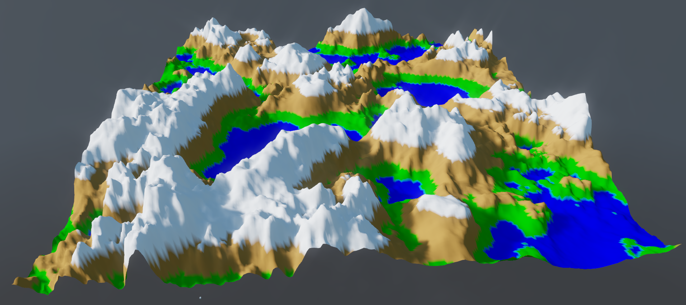

# Xenko Heightmap Terrain

A Heightmap terrain example for the [Xenko Engine](https://xenko.com/)

## Getting Started

#### Prerequisites

* Xenko version **3.1.0.1-beta02-0752** or higher

#### Usage

* Download / Clone the repo
* Open `HeightmapTerrain.sln` and run **OR** launch Xenko GameStudio, import the project and run

## Todos

* Add support for heightmaps that aren't square
* Viewable terrain within GameStudio
* In-Engine heightmap and Texture editing (currently have to use 3rd-party tools)

## Screenshots

## License

This project and its assets are licensed under the MIT License unless stated otherwise - see [LICENSE.md](LICENSE.md)

- The provided [heightmap](https://en.wikipedia.org/wiki/File:Heightmap.png) is licensed under the [public domain](https://en.wikipedia.org/wiki/Public_domain)
